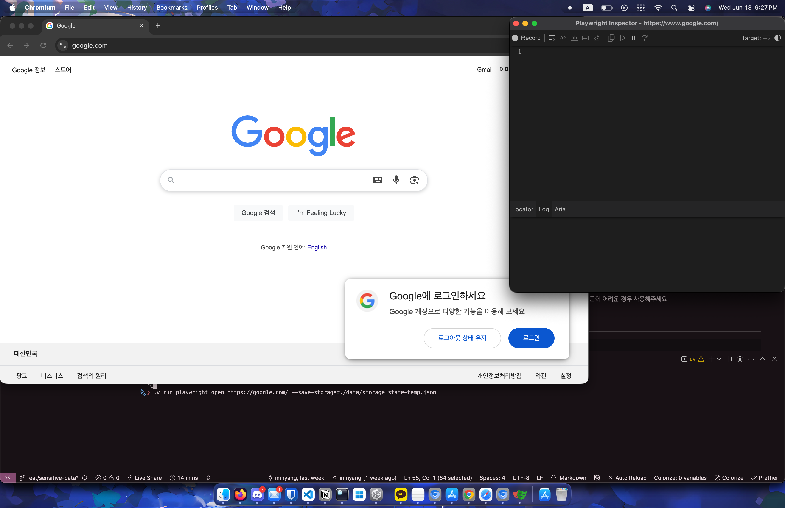
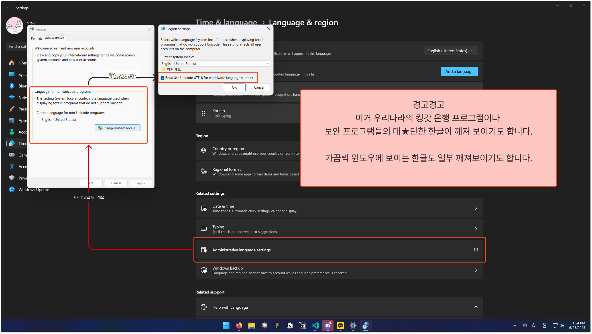
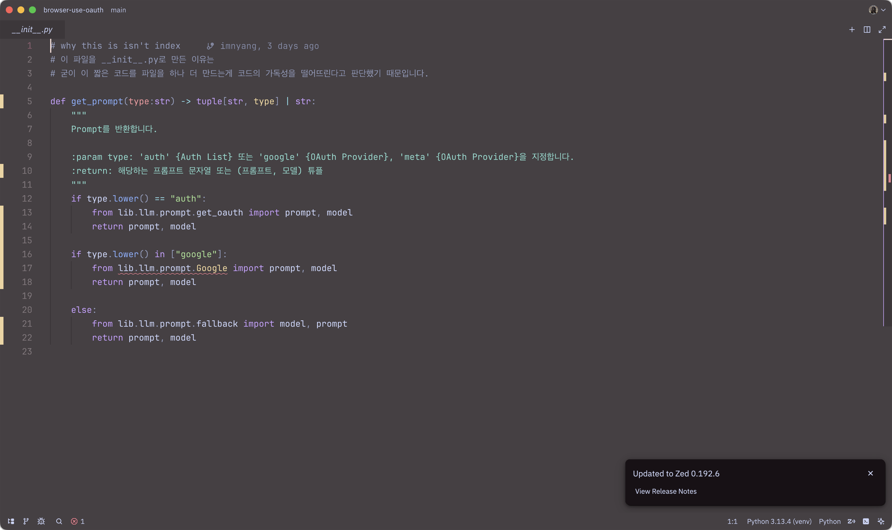

# 환경 설정

요구 사항
- [uv](https://docs.astral.sh/uv/getting-started/installation/) - Python Package Manager Written by Rust
- [oauth-backend](https://github.com/j93es/oauth-backend)
- [Google Chrome](https://www.google.com/intl/ko_kr/chrome/)

---

> [oauth-backend](https://github.com/j93es/oauth-backend) 프록시를 사용한다면 이 가이드에 따라 인증서 또한 설정되어야만 합니다.
>
> 그렇지 않으면 실행되지 않습니다.
>
> 윈도우 환경에서는 `sudo certutil -addstore root mitmproxy-ca-cert.cer`로 인증합니다.
>
> Sudo가 활성화되어있지 않은 환경에서는 관리자로 상향된 쉘에서 실행합니다.
>
> MacOS 환경에서는 `sudo security add-trusted-cert -d -p ssl -p basic -k /Library/Keychains/System.keychain ~/.mitmproxy/mitmproxy-ca-cert.pem`으로 인증합니다.
>
> 다른 플렛폼은 수동으로 설정되어야만 합니다.
> https://docs.mitmproxy.org/stable/concepts/certificates/

현재 아래와 같은 환경에서 개발되며 테스트되고 있습니다.
- ✅ MacOS 26 Tahoe Developer Beta 2 (25A5295e) en-US aarch64
- ✅ Windows 11 Pro for Workstations 24H2 (26100.4351) en-US x86_64
- ✅ NixOS 25.05.804570.c7ab75210cb8 KDE 6 / Linux 6.15 x86_64

---
다음과 같은 명령어로 환경을 설정합니다.

설명하는 가이드를 잘 따라가면 설정할 수 있습니다.

```sh
uv run setup.py
```


<details>
<summary>설치 및 설정 (레거시)</summary>

uv 설치 후 다음과 같은 명령어를 입력합니다.

```sh
uv sync
```

venv와 패키지가 설치가 됩니다.

---

~~browser_use가 Playwright에 대한 의존성이 있어 브라우저 설치가 필요합니다~~

스텔스 기능 때문에 Google Chrome이 필요합니다.

만약 설치가 되어 있지 않다면
```
playwright install chrome
```

Environment는 .env.example에 따라 설정되어야합니다.

.env.example을 .env로 복사하여서 사용해주세요.

## 로그인 방안

### 쿠키와 로컬 스토리지 설정 방법 (추천)



```sh
uv run playwright open https://google.com/ --save-storage=./data/storage_state.json
```

위 명령어를 실행하면 playwright Browser가 하나 열리는데 여기서 원하는 프로바이더를 모두 로그인 한 후에 브라우저를 정상적으로 닫으면 ./data/storage_state.json 경로에 쿠키, 로컬스토리지를 저장한 파일이 생성됩니다.

### Browser Use에게 직접 로그인 요청 (선택)
<details>
위에 쿠키와 로컬스토리지 설정 방법과 혼용해서 사용가능합니다.

`.sensitive.example.json`을 `.sensitive.json`으로 복사해서

안에 있는 예시 내용을 참고해서 작성해주시면 됩니다.
더 자세한 내용은
[Sensitive Data - Browser Use](https://docs.browser-use.com/customize/sensitive-data)를 참고하시면 좋을 것 같습니다.

[Sensitive Data - Browser Use](https://docs.browser-use.com/customize/sensitive-data)에서도 권장하지 않는 방법인만큼 애매하긴 하지만 쿠키와 로컬 스토리지를 저장하기 어려운 경우나 일부 flow에서 접근이 어려운 경우 사용해주세요.
</details>

</details>

---

# 윈도우 인코딩 이슈 해결
이거 해결 방법



이것도 setup.py 사용하면 반자동으로 할 수 있습니다.

못찾겠으면 intl.cpl 열어주세요.

# 실행

domains.txt는 실행시 자동으로 다운로드 됩니다.

```sh
curl "https://f.imnya.ng/.whs/tp-domains/data/domains/latest.txt" -o domains.txt
```

```sh
# uv run run.py {domains.txt 시작 줄} {domains.txt 끝 줄} {--skh} {--no-download}
uv run run.py 1 100 --skh
```

# Prompt 확장 가이드

## 1. 파일 생성

`lib/llm/prompt` 폴더에서 fallback 폴더를 복사하여

원하는 프로바이더를 추가해줍니다. `ex) lib/llm/prompt/Google/`

## 2. prompt.py 수정

Prompt에서 추가한 파일을 prompt.py에서 수정합니다.

만약 로그인 정보를 넣고 싶다면 Sensitive
`Log into example.com as user x_username with password x_password`

## 3. model.py

응답할 때 원하는 리턴 값을 `dict`로 받습니다.

## 4. \_\_init\_\_.py 수정


추가한 prompt에 따라 import합니다.

## 5. 사용 방법
```py
from lib.llm.prompt.fallback import prompt, model
```

# 참고하면 좋을만한 것

- [ ] 일부 웹사이트는 사용자의 언어에 따라 OAuth 옵션을 바꾸기도 합니다.
- [ ] https://docs.browser-use.com/customize/custom-functions
